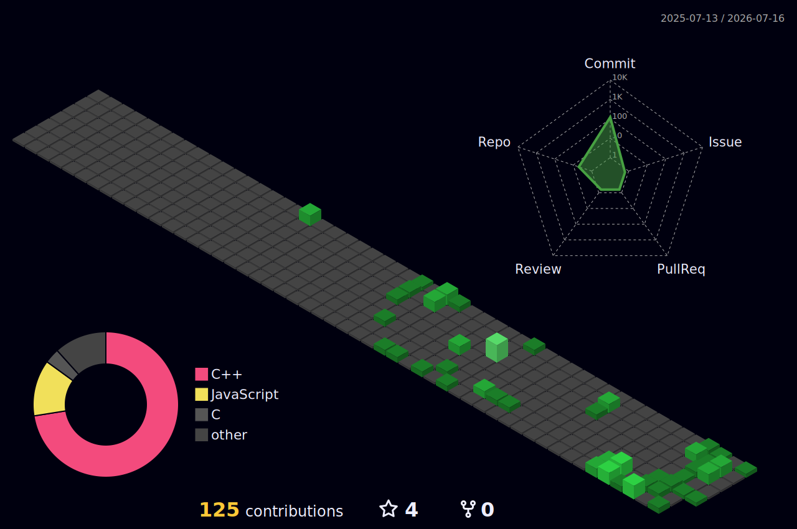

<h1 align="center">
  
</h1>

  
  
  
  

---

## About Me

I'm a **Computer Engineering student** with a strong focus on **competitive programming** and **full-stack web development**. I build tools that solve real problems — from data visualization platforms for astronomical research to algorithmic solutions on competitive coding platforms. Currently sharpening my skills in DSA while exploring the intersection of physics and software.

---

## Tech Stack

  

  

---

  

---

## Featured Projects

### [Cosmic Lens — JWST Data Visualization](https://github.com/DHBhensdadia/Cosmic-Lens-for-DUHACKS-5.0)

> An immersive, interactive platform for visualizing and exploring astronomical datasets from the James Webb Space Telescope.

Built during **DU Hacks 5.0** (36-hour national hackathon at DDU, Jan 2026) as **Team Leader & Frontend Architect** of Team Void Pointers. Features spectral analysis tools, high-redshift galaxy visualization, and a responsive data-driven web observatory.

  
  
  
  
  

[**Live Demo**](https://cosmic-lens-for-duhacks-5-0.vercel.app) · [**YouTube**](https://youtu.be/gAZHVYp_384) · [**Repository**](https://github.com/DHBhensdadia/Cosmic-Lens-for-DUHACKS-5.0)

---

### [Just Learning — CS Journey](https://github.com/DHBhensdadia/Just_learning)

Documenting my journey through Computer Engineering — C++ implementations of data structures, algorithms, and coursework solutions.

---

### [Tic-Tac-Toe](https://github.com/DHBhensdadia/Tic-Tac-Toe)

A clean Tic-Tac-Toe game built in C — my first systems programming project.

---

## Competitive Programming

<table>
  <tr>
    <td align="center"><a href="https://codeforces.com/profile/quantus-quasar"><b>Codeforces</b></a></td>
    <td align="center"><a href="https://leetcode.com/u/quantus-quasar/"><b>LeetCode</b></a></td>
    <td align="center"><b>HackerRank</b></td>
    <td align="center"><b>CodeChef</b></td>
    <td align="center"><b>CSES</b></td>
  </tr>
  <tr>
    <td align="center"><code>quantus-quasar</code></td>
    <td align="center"><code>quantus-quasar</code></td>
    <td align="center">C++ ⭐⭐⭐⭐</td>
    <td align="center">⭐</td>
    <td align="center">14 solved</td>
  </tr>
</table>

---

## On My Radar

Technologies I'm actively learning or plan to dive into next:

<table>
  <tr>
    <td><b>Backend</b></td>
    <td></td>
  </tr>
  <tr>
    <td><b>Databases</b></td>
    <td></td>
  </tr>
  <tr>
    <td><b>DevOps & Cloud</b></td>
    <td></td>
  </tr>
  <tr>
    <td><b>Mobile</b></td>
    <td></td>
  </tr>
  <tr>
    <td><b>Systems</b></td>
    <td></td>
  </tr>
  <tr>
    <td><b>AI / ML</b></td>
    <td></td>
  </tr>
  <tr>
    <td><b>Frontend</b></td>
    <td></td>
  </tr>
  <tr>
    <td><b>Tools</b></td>
    <td></td>
  </tr>
</table>

---

## GitHub Stats

  
  

  

---

  

  

<picture>
  <source media="(prefers-color-scheme: dark)" srcset="https://raw.githubusercontent.com/DHBhensdadia/DHBhensdadia/output/snake-dark.svg" />
  <source media="(prefers-color-scheme: light)" srcset="https://raw.githubusercontent.com/DHBhensdadia/DHBhensdadia/output/snake.svg" />
  
</picture>

  

